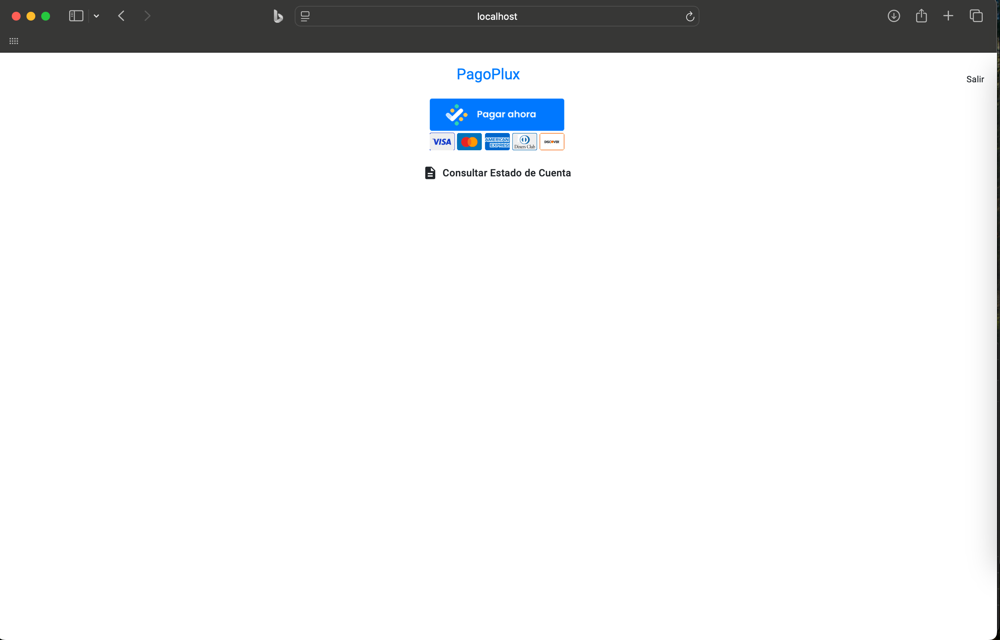

# Prueba_RichardAldana

Elaborar un sistema de autenticación sencillo (frontend angular y backend en NodeJs) que
permita iniciar sesión a través de un backend que se conecte a una base de datos de su
preferencia. La validación de campos de usuario y contraseña se debe realizar en el
backend.
Una vez que el usuario ingresa debe dar clic en el botón de pagos de PagoPlux y posterior al pago con las tarjetas de prueba debe ejecutarse un servicio de
consultas de transacciones por API, el cual debe conectarse a través del backend (se
adjunta en el correo.

## Tabla de Contenidos

- [Características](#características)
- [Tecnologías Utilizadas](#tecnologías-utilizadas)
- [Instalación](#instalación)
- [Uso](#uso)
- [Demostración](#demostracion)

## Características

- Login con conexión a backend en NodeJs
- Frontend Angularjs
- Realizar consumo de API de consultas por backend

## Tecnologías Utilizadas

- **Frontend:** Angular, Bootstrap
- **Backend:** Node.js, Express
- **Base de Datos:** MongoDB
- **Autenticación:** JWT
- **Gestión de Dependencias:** npm

## Instalación

### Clonar el Repositorio

1. Clona el repositorio:

```bash
git clone https://github.com/tu-usuario/tu-repo.git
cd tu-repo
```

2.	Navega al directorio del proyecto:

```bash
cd PagoPlux
```
### Backend

1.	Navega al directorio backend:
```bash
cd backend
```

2.	Instala las dependencias:
```bash
npm install
```

3.	Configura tu base de datos en el archivo src/config/db.js.
4.	Configura las variebles de entornoen el archivo /.env
5.	Inicia el servidor:
```bash
npm run dev
```

### Frontend

1.	Navega al directorio backend:
```bash
cd frontend
```

2.	Instala las dependencias:
```bash
npm install
```

3.	Configura tu base de datos en el archivo src/config/db.js.
4.	Inicia el servidor:
```bash
ng serve
```

  -	La aplicación se ejecutará en http://localhost:4200 para el frontend y http://localhost:5000 para el backend.
  -	Puedes registrar un nuevo usuario y autenticarte. Las transacciones se mostrarán en una tabla.
  -	Al hacer clic en una fila de la tabla, se abrirá un modal con detalles adicionales sobre la transacción.

## Demostración

## Imágenes del proyecto

### Pantalla de inicio



### Pantalla de botón de pagos


### Pantalla de aceptar la transaccion


### Pantalla de los datos de la transaccion


### Pantalla de transacciones realizadas


### Pantalla de detalles de la transacción


Mira el siguiente video para obtener una demostración del proyecto en funcionamiento:

[](https://youtu.be/t64EE9z_YhA)

Haz clic en la imagen para reproducir el video.
